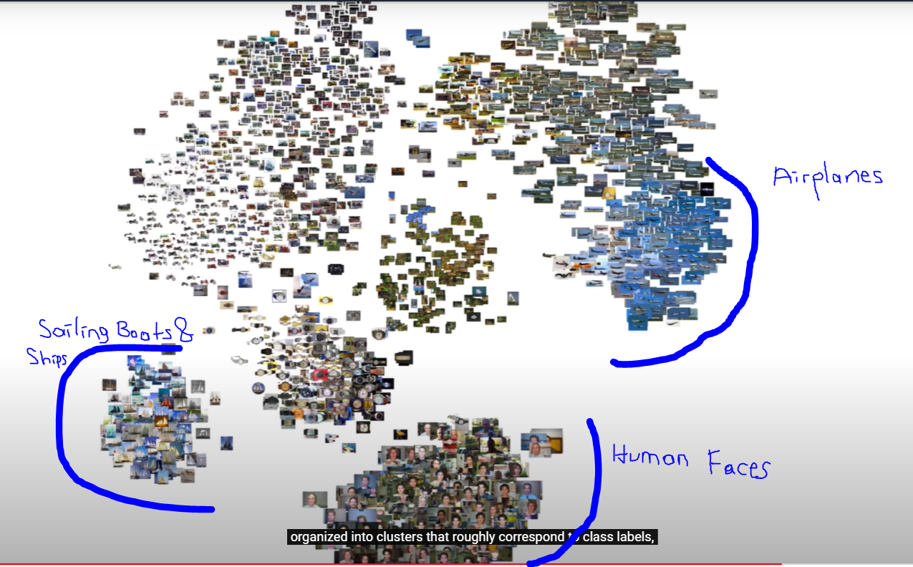

# TextTract
General Worflow is as follows:

## General Resources
Pandas Text Processing: https://pandas.pydata.org/pandas-docs/stable/user_guide/text.html

nltk.tokenize package: http://www.nltk.org/api/nltk.tokenize.html

Regex in Python: https://docs.python.org/3/library/re.html

Text Processing Example Python: https://github.com/udacity/AIND-NLP/blob/master/text_processing.ipynb

Beautiful Soup: https://www.crummy.com/software/BeautifulSoup/bs4/doc/

Library for fast text representation and classification: https://github.com/facebookresearch/fastText

GloVe: Global Vectors for Word Representation https://nlp.stanford.edu/projects/glove/
GloVe is better than Word2Vec. How they are different: https://www.quora.com/How-is-GloVe-different-from-word2vec

## Representational Learning
t-SNE: t-Distributed Stochastic Neighbor Embedding. t-SNE is a way to visualize the high dimensional word embeddings.
https://towardsdatascience.com/an-introduction-to-t-sne-with-python-example-5a3a293108d1

t-SNE works with different kinds of dataset too such as images. Take a look at the image  and the link here: https://medium.com/@pslinge144/representation-learning-cifar-10-23b0d9833c40

- Sample notebook for t-SNE run on CIFAR-10 image data: https://colab.research.google.com/drive/1r6o7GmIOTo_33JyyzbSWunGtunzGK5we?usp=sharing

Efficient Estimation of Word Representations in
Vector Space
:
https://video.udacity-data.com/topher/2018/October/5bc56d28_word2vec-mikolov/word2vec-mikolov.pdf

Distributed Representations of Words and Phrases
and their Compositionality:https://video.udacity-data.com/topher/2018/October/5bc56da8_distributed-representations-mikolov2/distributed-representations-mikolov2.pdf

## Datasets
- The RVL-CDIP Dataset: https://www.cs.cmu.edu/~aharley/rvl-cdip/
https://paperswithcode.com/paper/layoutlm-pre-training-of-text-and-layout-for 94.42% accuracy achieved, best so far on the RVL-CDIP dataset.
Sample notebook: https://www.kaggle.com/nbhativp/document-classification
Sample project 1: https://github.com/jpcrum/Final-Project-Group5
Sample project 2:https://github.com/Ilovemysr/rvl-cdip/blob/master/rvl_cdip_final_extraction.ipynb

- PubLayNet Dataset: https://developer.ibm.com/exchanges/data/all/publaynet/ 
https://dataplatform.cloud.ibm.com/analytics/notebooks/v2/43cb95d9-6c3e-479c-a189-8c9ff3524ec1/view?access_token=bb8ce645cf114b5f5512ae2eb9c7badcf0927f313e8f76b8138d0701289484e6

## OCR 101
A Gentle Intro to OCR:
https://towardsdatascience.com/a-gentle-introduction-to-ocr-ee1469a201aa?gi=58ff4a07494b

## Docker Usage
https://towardsdatascience.com/machine-learning-with-big-data-86bcb39f2f0b

## Very good Example Docker App:
Example Voting App with MySQL, Redis, Python Flask and HTML
https://github.com/dockersamples/example-voting-app

## Best Result achieved for RVL-CDIP
https://github.com/jdegange/Benchmarking-Modern-CNN-Architectures-to-RVL-CDIP
https://medium.com/@jdegange85/benchmarking-modern-cnn-architectures-to-rvl-cdip-9dd0b7ec2955

InceptionResNetV2 with penalized learning rate with vanilla SGD on 512x512 gave the best result

## Some Additional Papers
Modular Multimodal Architecture for Document Classification: https://www.groundai.com/project/modular-multimodal-architecture-for-document-classification/1

Real-Time Document Image Classification using Deep CNN and Extreme Learning Machines: https://www.groundai.com/project/real-time-document-image-classification-using-deep-cnn-and-extreme-learning-machines/1

Evaluation of Deep Convolutional Nets for Document Image Classification and Retrieval: https://www.cs.cmu.edu/~aharley/icdar15/

## Final Models
rvlcdip model had final accuracy 65%. 
loss: 1.1834 - acc: 0.6500 - categorical_crossentropy: 1.1834 - val_loss: 1.2591 - val_acc: 0.6075 - val_categorical_crossentropy: 1.2591

## New Model
https://github.com/microsoft/unilm/tree/master/layoutlm

python run_classification.py  --data_dir  data \
                              --model_type layoutlm \
                              --model_name_or_path path/to/pretrained/model/directory \
                              --output_dir path/to/output/directory \
                              --do_lower_case \
                              --max_seq_length 512 \
                              --do_train \
                              --do_eval \
                              --num_train_epochs 40.0 \
                              --logging_steps 5000 \
                              --save_steps 5000 \
                              --per_gpu_train_batch_size 16 \
                              --per_gpu_eval_batch_size 16 \
                              --evaluate_during_training \
                              --fp16 
Similarly, you can do evaluation by changing --do_train to --do_eval and --do_test

## 
- [x] Create UI
- [x] Add a trained model
- [x] Create the Server
- [ ] Add Code Climate for Coverage
- [ ] Create API endpoint for recognition
- [ ] Add OCR to the client side
- [ ] Store Pre-trained models in backend
- [ ] Deploy to Heroku
- [ ] Containerized the App
- [ ] Add Travis CI/CD
- [ ] Format the End result
- [ ] Store all the data inside the DB
